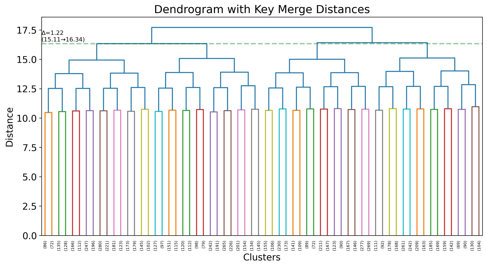
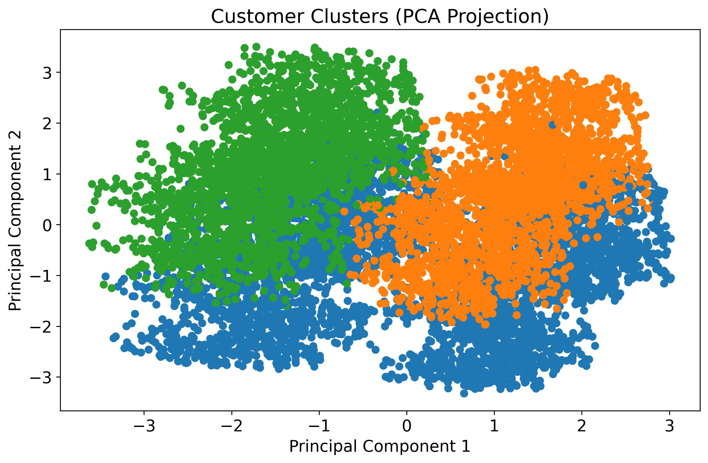

# Customer Segmentation — Hierarchical Clustering with Gower Distance

This project segments telecom customers into distinct behavioral groups using **agglomerative hierarchical clustering** on a mixed dataset of continuous and categorical variables. Rather than restricting the analysis to numeric features, Gower distance is used to measure similarity across both data types simultaneously — enabling more holistic and realistic customer segmentation.

The analysis covers:

- **Preprocessing:** Variable selection, missing value handling, normalization of continuous features, and Gower distance matrix computation.
- **Clustering:** Agglomerative hierarchical clustering with average linkage, producing a dendrogram used to determine the optimal number of clusters.
- **Cluster Selection:** Linkage distance analysis identifying the largest meaningful gap — resulting in **3 customer segments**.
- **Visualization:** PCA projection of clusters into 2D space for interpretability (PCA is used only for visualization, not for clustering).
- **Segment Profiling:** Each cluster characterized by tenure, service usage, and monthly charges to support targeted retention strategies.

> **Note on Dataset Availability**
> The dataset (`churn_clean.csv`) has been removed from this repository as it is proprietary and cannot be shared publicly. All visualizations and outputs generated during the analysis are retained in the `Figures/` folder for reference and presentation purposes.

---

## Why Hierarchical Clustering

Hierarchical clustering was chosen because the dataset contains a mix of categorical variables (contract type, payment method, internet service) and continuous variables (tenure, monthly charges, bandwidth usage). Standard k-means cannot handle categorical data natively. Gower distance resolves this by computing a unified similarity measure across all variable types — making hierarchical clustering the natural fit for this segmentation problem.

---

## Variables

| Variable | Type | Why Included |
|---|---|---|
| `Tenure` | Continuous | Measures customer loyalty |
| `MonthlyCharge` | Continuous | Represents customer value |
| `Bandwidth_GB_Year` | Continuous | Captures usage behavior |
| `Income` | Continuous | Indicates purchasing power |
| `Outage_sec_perweek` | Continuous | Reflects service quality experience |
| `Contract` | Categorical | Strong driver of churn behavior |
| `InternetService` | Categorical | Service type segmentation |
| `TechSupport` | Categorical | Support engagement |
| `DeviceProtection` | Categorical | Add-on adoption behavior |
| `StreamingTV` | Categorical | Usage pattern |
| `PaymentMethod` | Categorical | Financial behavior |
| `PaperlessBilling` | Categorical | Engagement preference |

---

## Analysis Summary

### Preprocessing Steps
1. Select relevant variables
2. Fill missing `InternetService` values with `"None"` (customers without internet service — not dropped)
3. Cast categorical columns to string type for Gower compatibility
4. Normalize continuous variables using MinMaxScaler
5. Compute Gower distance matrix
6. Save cleaned dataset as `data/cleaned_churn_data.csv`

### Optimal Number of Clusters

Linkage distances were extracted and consecutive differences analyzed to find significant jumps in dissimilarity. Constraining the search to 2–6 cluster solutions, the largest gap occurred at **15.11 → 16.34 (Δ = 1.22)**, corresponding to a cut threshold of **16.34** — yielding **3 clusters**.

| Dendrogram |
|---|
|  |

### Cluster Visualization (PCA Projection)

| PCA Cluster Plot |
|---|
|  |

### Cluster Profiles

| Cluster | Tenure | Monthly Charge | Streaming | Interpretation |
|---|---|---|---|---|
| Cluster 1 | Very low | Moderate | Mixed | New / early-stage customers — higher churn risk |
| Cluster 2 | High | Low | No | Stable but low-engagement users |
| Cluster 3 | High | Highest | Yes | High-value, fully engaged customers |

> Streaming service usage emerged as the key differentiator between clusters 2 and 3. Contract type, internet service, and payment method showed minimal variation across clusters — behavioral variables drive segmentation more than account configuration.


---

## How to Run

### Prerequisites

```bash
pip install -r requirements.txt
```

### Dataset Setup

Place the dataset inside the `data/` folder:

```
project/
├── data/
│   └── churn_clean.csv         ← put it here
├── main.py
├── requirements.txt
└── README.md
```

### Run

```bash
python main.py
```

The script handles all preprocessing, Gower distance computation, hierarchical clustering, cluster selection, PCA visualization, and profiling automatically. All outputs are saved to the `Figures/` folder.

---

## Project Structure

```
project/
├── data/                            # Raw dataset (not included — see note above)
├── Figures/                          # Dendrogram, PCA plot, cluster profiles, cleaned CSV
│   └── cleaned_churn_data.csv
├── main.py                          # Entry point — run this
├── requirements.txt
└── README.md
```

## Key Libraries

| Library | Purpose |
|---|---|
| `pandas` | Data loading, variable selection, missing value handling |
| `numpy` | Numerical operations |
| `gower` | Gower distance matrix for mixed data types |
| `scipy` | Hierarchical clustering (`linkage`, `dendrogram`, `fcluster`) |
| `scikit-learn` | MinMaxScaler normalization, PCA visualization |
| `matplotlib` / `seaborn` | Dendrogram, PCA plot, cluster distribution plots |
